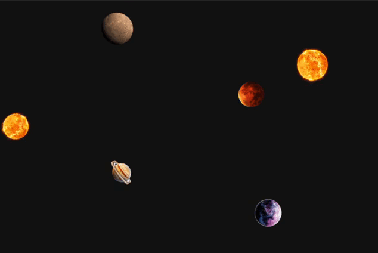

# Space Simulation
A dynamic space simulation where you can create planets, trigger meteor showers, and launch spaceships. 
Explore and interact with a destructible universe in real time.

  

### Features:
- #### Add new planets
    - Add new planets to space to build a unique environment
- #### Meteor Shower
    - Toggle on a destructive meteor shower
- #### Create a giant meteor 
    - A giant meteor destroys everything in its way
- #### Launch a spaceship
    - Launch a spaceship that navigates threw space and tries to dodge planets and meteors!

---

This project was build by using [Cursor](https://www.cursor.com/).
